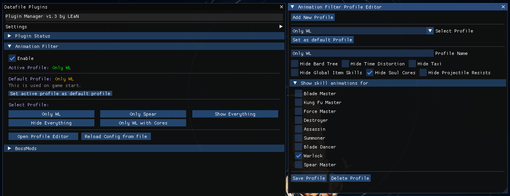

# BnS Animation Filter

## A Blade & Soul NEO datafile plugin to show/hide the skills for specific classes/specializations to provide a cleaner screen in combat without hiding party members.

## Ingame Gui Example



## Features
- Show/hide skills for specific classes/specializations.
- Up to 5 profiles.
- Reload/switch profiles during gameplay.
- Does not hide party buffs or party protection skills. (Soulburn, Polarity, Uplift, HMB, Stealth proc.)
- Does not hide Bard tree by default. Can be hidden in config.
- Does not hide Assassin taxi by default. Can be hidden in config.
- Does not hide Warlock TD by default. Can be hidden in config.

## Config
- The config file must be located at: `Documents/BNS/animfilter_config.xml`
- Please check the example config file for the correct format: [animfilter_config.xml](animfilter_config.xml)
- The profiles can also be edited in-game using the pluginloader gui

## Extra options
You can set extra options for a profile.
- Hide Bard tree
- Hide Assassin taxi
- Hide Time Distortion
- Hide Soulcores
```xml
<extra_options hideSoulCores="true" hideTree="true" hideTaxi="true" hideTD="true" />
```
Remove the options you dont want.

## Dependencies
- Requires [DatafilePluginloader](https://github.com/leanleon93/BnsPlugin_DatafilePluginloader) to work